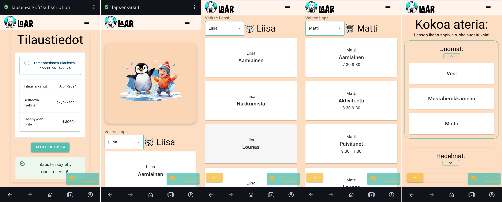

# LAAR - Lapsen Arki

Web application for ideas and helping scheduling daily activities in families with children.

Web application is using stack of: Vite, MUI, TypeScript, Node.js, Firebase, Cypress, Jest, Azure, Docker.

Teammates working on this project were:
- [@hasse331](https://github.com/hasse331) - Project management, auth, admin and main features 
- [@esaleino](https://github.com/esaleino) - CI/CD, DevOps, testing, azure, account management
- [@saukkeli](https://github.com/saukkeli) - Profile management
- [@jholopai](https://github.com/jholopai) - Stripe payment API
- [@nawzad-hassan](https://github.com/nawzad-hassan) - ChatBot, message features 
- [@johannaelisa](https://github.com/johannaelisa) - Frontend, GUI, styling

  

